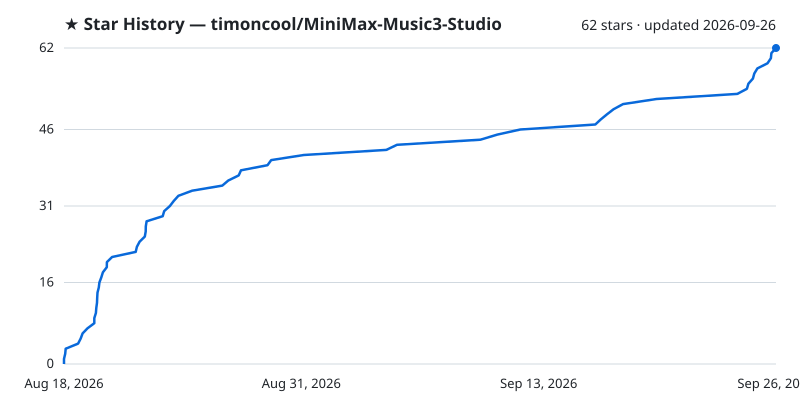

<div align="center">

<!-- studio family tabs -->
[](https://github.com/timoncool/YuE2-Studio) [](https://github.com/timoncool/MiniMax-Music3-Studio) [](https://github.com/timoncool/ACE-Step-Studio)


# MiniMax Music3 Studio

**Full-length AI music on your own GPU. One executable — no Python, no Node.js, no launcher.**

[](https://timoncool.github.io/MiniMax-Music3-Studio/)
[](https://github.com/timoncool/MiniMax-Music3-Studio/releases/latest)
[](DONATE.md)

[](https://github.com/timoncool/MiniMax-Music3-Studio/stargazers)
[](LICENSE)
[](https://github.com/timoncool/MiniMax-Music3-Studio/commits/main)
[](https://github.com/timoncool/MiniMax-Music3-Studio/issues)

[](#architecture)
[](#architecture)
[](#architecture)
[](#models)

**English** · [Русский](https://timoncool.github.io/MiniMax-Music3-Studio/ru.html) · [中文](https://timoncool.github.io/MiniMax-Music3-Studio/zh.html) · [日本語](https://timoncool.github.io/MiniMax-Music3-Studio/ja.html) · [한국어](https://timoncool.github.io/MiniMax-Music3-Studio/ko.html)


</div>

A Windows desktop studio for **MiniMax Music3**. Write a caption and lyrics, generate a
full-length track on your own GPU, and keep everything — audio, settings and the exact
request that produced it — in a local library.

One executable. No Python, no Node.js, no launcher script, nothing phoning home unless you
ask it to.

## For AI agents

Given this repository, an agent can set everything up and drive the studio by itself:

1. Install the studio from the [latest release](https://github.com/timoncool/MiniMax-Music3-Studio/releases/latest) and start it.
2. Connect to its MCP server at `http://127.0.0.1:8765/mcp`:
   `claude mcp add --transport http minimax-studio http://127.0.0.1:8765/mcp`
3. Read the skill it serves (resource `studio://skill`, prompt `studio`), the same text as
   [docs/mcp-skill.md](docs/mcp-skill.md), and start with the tool `studio_status`.

[llms.txt](llms.txt) says the same for tools that look for it. To keep the skill in Claude
Code, save [docs/mcp-skill.md](docs/mcp-skill.md) as `~/.claude/skills/minimax-music3-studio/SKILL.md`.

## What you can do

- **Generate music locally** with the complete Music3 component set: caption, lyrics,
  duration, DiT steps, LM CFG and top-k, DiT CFG, peak clip, separate DiT and LM seeds,
  several songs per prompt and several variations per song, MP3 or 16/24/32-bit WAV.
- **Reproduce any track exactly.** Every generation stores its request and its audio codes,
  so a track can be re-rendered deterministically, or re-rendered with different steps,
  seed or output format.
- **Word-level karaoke** — enhanced LRC with a timestamp on every word, aligned by
  Parakeet, Whisper or a cloud model. Your lyrics are kept; only the timing is borrowed.
- **Karaoke video** written with the bundled ffmpeg, hardware-encoded when the machine can
  and software-encoded when it cannot.
- **A writing assistant** for captions and lyrics, from a local GGUF model or OpenRouter,
  following MiniMax's own published prompting skill. Lyrics you wrote yourself get their
  section tags with one button, the words exactly as you wrote them.
- **Cover art from templates** — write the look once with `{title}`, `{style}` and
  `{excerpt}`, and the track fills the rest in.
- **Manage your library** — search, playlists, favourites, rename, import your own audio,
  export tracks, edit audio in the built-in editor.
- **Watch what generation costs** — live GPU load, VRAM, temperature, power draw, RAM and
  engine memory, in the sidebar or in a pop-out panel.
- **Add cloud capabilities when you want them.** Speech-to-text, a caption/lyrics
  assistant, cover art and cloud music can each independently use OpenRouter, chosen from
  the live model catalog. Local stays the default.
- **Split a finished track into six stems** — drums, bass, other, vocals, guitar and
  piano — with HT-Demucs on the GPU, or on the CPU when you prefer. The model is an
  optional download like everything else.
- **Any track to MIDI** — a song, a stem or a processed take becomes multi-instrument MIDI
  (34 instrument groups and drums) with MuScriptor on the GPU, through HOT-Step's native
  port. A piano roll fills in while it listens; play it against the original, mute or solo
  an instrument, save the .mid. Downloaded the first time it is used.
- **Every result is a track** — stems, a processed take, a re-render and a cover land in
  the library as tracks of their own, each linked to the one it was made from and keeping
  the settings it was made with.
- **Export files that carry their own data** — MP3s are written with ID3v2.4: title,
  artist, album, genre, tempo, the lyrics and the cover art.
- **Choose your own quality/VRAM trade-off** in the model manager. Nothing downloads by
  itself.
- **LoRA** — LoRA and LoKr for the language model (the composition) and for the DiT (the
  sound), each with its own strength, picked in the create form. The engine reads PEFT,
  LyCORIS, diffusers and ComfyUI files. A catalogue of ready ones with their authors
  credited, and a search on Hugging Face that downloads what you pick.
- **Train your own LoRA** — an optional tab on the LoRA page: songs of one artist or
  style become a language-model LoRA on your own card, with HOT-Step's `mm3-lm-train` and
  its HOT-PiZZA recipe. Every setting is editable. Datasets move between this studio and
  YuE2 Studio as a folder, and each saved checkpoint goes into the LoRA library in one
  click.
  - **A three-step wizard** — drop a folder of songs, check them, train. Albums with a
    cue sheet are cut into songs; titles and artists come from the tags, the file name and
    the folders.
  - **Preparation on its own** — lyrics come from the lyric databases players use (LRCLIB,
    QQ Music, Kugou), word for word; only a song none of them knows has its vocals
    separated and is heard by Whisper, with its usual hallucinations filtered out. The
    assistant lays the lyrics out in sections. MOSS-Music listens to every song and writes
    its structured caption, with the tempo and key measured on the card by Beat This! and
    S-KEY.
  - **Every song shows where it is** — lyrics and captions appear as each song is done,
    one model on the card at a time, each loaded once for the whole batch. A song that
    failed or was stopped has a button that finishes just that song.
  - **Picks up after a restart** — each song keeps what it has; a preparation cut off by a
    crash or a restart carries on by itself and redoes nothing.
  - **Stop by steps or by epochs** — a fixed number of steps, or a number of passes over
    the songs.
  - **A trigger word from the start** — every dataset gets a rare word made from its name,
    which you can change.
  - **Train further** — a finished LoRA-method run goes on from where it stopped: set a
    higher step count and the loss chart and the checkpoints continue instead of starting
    over. (PiSSA and HOT-PiZZA runs cannot: the trainer does not keep the frozen factors
    they are measured against.)
- **Audio processing** — noise reduction, the Spectral Lifter, a vocal naturaliser, your
  own VST3 plugins in a chain, and mastering to a reference track. Compare before and
  after while it plays, then keep the result as a version of the track or throw it away.
- **MP3 made by the studio** — the engine renders 32-bit float and the studio encodes the
  MP3 with LAME, so nothing is lost before the encoder.
- **Fewer steps, same sharpness** — below 30 DiT steps the engine raises the flow shift by
  itself (`29/(steps-1)`), so a fast render keeps its detail.

## Screenshots

| | |
|---|---|
|  |  |
| Any track to MIDI — a piano roll of every instrument, played against the original | Your own LoRA trained on the card — the loss as it learns, a checkpoint every 100 steps |
|  |  |
| A dataset — lyrics found, the caption written by ear, tempo and key measured | The LoRA catalogue — styles, artists and sound, downloaded in one pass |
|  |  |
| Audio processing — noise reduction, Spectral Lifter, VST3, mastering to a reference | An agent over MCP — the address and the lines for Claude Code and other clients |
|  |  |
| Tracks made by tools stay in the library, linked to their original | Writing a track — the caption as a document, every parameter a slider |
|  |  |
| A finished track — cover, timed lyrics, the request that made it | Studio tools — six-stem separation on the GPU, transcription, editor |
|  |  |
| Model sets — one quantisation per role, switchable once installed | Every capability runs where you say, local or OpenRouter |
|  | |
| Cover art — large preview, prompt templates filled from the track | |

The same screens are in the interface language you read: [Русский](https://timoncool.github.io/MiniMax-Music3-Studio/ru.html),
[中文](https://timoncool.github.io/MiniMax-Music3-Studio/zh.html), [日本語](https://timoncool.github.io/MiniMax-Music3-Studio/ja.html),
[한국어](https://timoncool.github.io/MiniMax-Music3-Studio/ko.html) — on the project page, or in
[docs/screenshots](docs/screenshots).

## What it needs

Windows 10/11 x64 and an NVIDIA card **from the GTX 900 series on**. The studio ships two
CUDA builds of the engine and picks the one your card and driver run: CUDA 13 for Turing
and newer (GTX 16, RTX 20–50, Tesla T4, A100, RTX A-series, L4/L40, H100) with driver 580
or newer, CUDA 12 for Maxwell, Pascal and Volta (GTX 900/1000, Titan X/Xp/V, Tesla M40,
P40, P100, V100) and for any card on a driver from 525 to 579. Both carry compiled code for
every one of those architectures, so nothing is left for the driver to compile.

Training a LoRA is optional and needs an NVIDIA RTX 30-series card or newer with 22 GB of
VRAM (an RTX 3090, 4090 or 5090) and about 10.5 GB more disk for the trainer and its
weights, downloaded only when you open training. Describing songs by ear needs about
12 GB of VRAM and 10 GB more disk for MOSS-Music; without it the captions are written by
hand.

## Drive it from an agent (MCP)

While the studio is open it serves MCP at `http://127.0.0.1:8765/mcp`: an agent such as
Claude Code, Claude Desktop or Cursor does everything the page does, through the same code -
songs, the library, covers, stems, MIDI, karaoke, processing, video clips, the player, LoRA, and a
LoRA from a folder of songs end to end - and sees and works the window itself: a
screenshot, its controls, clicks and typing. 162 tools, grouped by area. MiniMax's own
caption rules and reference captions come with the server, so the agent writes the
captions, lyrics and lyric layouts itself instead of the studio's small assistant.

With **Agent (MCP)** chosen as the writing assistant (Settings, Models), the connected agent
also answers the studio's own write buttons and dataset preparation. Settings, **Agent
(MCP)** shows whether an agent is connected and what to paste into the client.

```bash
claude mcp add --transport http minimax-studio http://127.0.0.1:8765/mcp
```

[docs/mcp-skill.md](docs/mcp-skill.md) is the skill an agent reads: every tool, what the
model expects, and step-by-step recipes.

## Models

A runnable Music3 installation is always five components: language model, RVQ depth
decoder, condition encoder, DiT and vocoder.

| Your GPU | Recommended profile | Download |
| --- | --- | --- |
| 30 GB VRAM and above | Full Native — BF16 / BF16 / F32 | 28.6 GB |
| 15 GB and above | Quality — Q8_0 | 12.8 GB |
| 11.5 GB and above | Balanced — Q6_K / Q8_0 / Q5_K_M | 9.8 GB |
| 9.5 GB and above | Light — Q4_K_M / Q4_K_M / Q4_K_S | 7.7 GB |
| 8 GB cards | Minimal — Q3_K_M | 6.5 GB |

The studio detects your GPU and preselects the profile it can actually run, but the
download is always your decision. Every component is checksum-verified against a pinned
Hugging Face revision and downloads resume where they stopped.

Every profile is the same five roles at a different quantisation. The heavier sets — Q5
and up, and the original BF16/F32 weights — come from
[Serveurperso/MiniMax-Music3-GGUF](https://huggingface.co/Serveurperso/MiniMax-Music3-GGUF);
the lighter ones that let the studio fit an 8 GB card — Q4 and below, plus the two FP4
formats — come from [scragnog/MiniMax-Music3-GGUF](https://huggingface.co/scragnog/MiniMax-Music3-GGUF).
Both repositories are pinned to a fixed revision.

The files are written to, and can be dropped into by hand at:

- **Installed:** `%LOCALAPPDATA%\MiniMax Music3 Studio\models\minimaxmusic-cpp\`
- **Portable:** `<the folder you unzipped>\data\models\minimaxmusic-cpp\`

Filenames must match the catalogue exactly. The studio checks each file's size and SHA-256,
so a file you place by hand is recognised as already installed and never re-downloaded.

<details>
<summary><b>Model zoo — every file, with direct download links</b></summary>

Only the profile that matches your GPU is downloaded automatically; the rest are here for
manual placement or for building a custom mix role-by-role in the model manager.

**Language model (writes the audio-token stream)**

| File | Size | Used by | Source |
| --- | --- | --- | --- |
| [`MiniMax-Music3-language_model-BF16.gguf`](https://huggingface.co/Serveurperso/MiniMax-Music3-GGUF/resolve/9cdffedb54de2509ae55a6831a677645fb353a7d/MiniMax-Music3-language_model-BF16.gguf) | 17.17 GB | Full native | Serveurperso |
| [`MiniMax-Music3-language_model-Q8_0.gguf`](https://huggingface.co/Serveurperso/MiniMax-Music3-GGUF/resolve/9cdffedb54de2509ae55a6831a677645fb353a7d/MiniMax-Music3-language_model-Q8_0.gguf) | 9.13 GB | Quality | Serveurperso |
| [`MiniMax-Music3-language_model-Q6_K.gguf`](https://huggingface.co/Serveurperso/MiniMax-Music3-GGUF/resolve/9cdffedb54de2509ae55a6831a677645fb353a7d/MiniMax-Music3-language_model-Q6_K.gguf) | 7.05 GB | Balanced | Serveurperso |
| [`MiniMax-Music3-language_model-Q5_K_M.gguf`](https://huggingface.co/Serveurperso/MiniMax-Music3-GGUF/resolve/9cdffedb54de2509ae55a6831a677645fb353a7d/MiniMax-Music3-language_model-Q5_K_M.gguf) | 6.28 GB | Custom | Serveurperso |
| [`mm3-lm-Q4_K_M.gguf`](https://huggingface.co/scragnog/MiniMax-Music3-GGUF/resolve/6781ce79b21beb7413f6b2358cd4adb355217c3d/mm3-lm-Q4_K_M.gguf) | 5.51 GB | Light | scragnog |
| [`mm3-lm-Q4_K_S.gguf`](https://huggingface.co/scragnog/MiniMax-Music3-GGUF/resolve/6781ce79b21beb7413f6b2358cd4adb355217c3d/mm3-lm-Q4_K_S.gguf) | 5.29 GB | Custom | scragnog |
| [`mm3-lm-Q3_K_M.gguf`](https://huggingface.co/scragnog/MiniMax-Music3-GGUF/resolve/6781ce79b21beb7413f6b2358cd4adb355217c3d/mm3-lm-Q3_K_M.gguf) | 4.59 GB | Minimal | scragnog |
| [`mm3-lm-MXFP4.gguf`](https://huggingface.co/scragnog/MiniMax-Music3-GGUF/resolve/6781ce79b21beb7413f6b2358cd4adb355217c3d/mm3-lm-MXFP4.gguf) | 5.44 GB | Custom (FP4) | scragnog |
| [`mm3-lm-NVFP4.gguf`](https://huggingface.co/scragnog/MiniMax-Music3-GGUF/resolve/6781ce79b21beb7413f6b2358cd4adb355217c3d/mm3-lm-NVFP4.gguf) | 5.66 GB | Custom (Blackwell FP4) | scragnog |

**DiT / transformer (the diffusion generator)**

| File | Size | Used by | Source |
| --- | --- | --- | --- |
| [`MiniMax-Music3-transformer-F32.gguf`](https://huggingface.co/Serveurperso/MiniMax-Music3-GGUF/resolve/9cdffedb54de2509ae55a6831a677645fb353a7d/MiniMax-Music3-transformer-F32.gguf) | 9.73 GB | Full native | Serveurperso |
| [`MiniMax-Music3-transformer-Q8_0.gguf`](https://huggingface.co/Serveurperso/MiniMax-Music3-GGUF/resolve/9cdffedb54de2509ae55a6831a677645fb353a7d/MiniMax-Music3-transformer-Q8_0.gguf) | 2.60 GB | Quality | Serveurperso |
| [`MiniMax-Music3-transformer-Q6_K.gguf`](https://huggingface.co/Serveurperso/MiniMax-Music3-GGUF/resolve/9cdffedb54de2509ae55a6831a677645fb353a7d/MiniMax-Music3-transformer-Q6_K.gguf) | 2.01 GB | Custom | Serveurperso |
| [`MiniMax-Music3-transformer-Q5_K_M.gguf`](https://huggingface.co/Serveurperso/MiniMax-Music3-GGUF/resolve/9cdffedb54de2509ae55a6831a677645fb353a7d/MiniMax-Music3-transformer-Q5_K_M.gguf) | 1.69 GB | Balanced | Serveurperso |
| [`MiniMax-Music3-transformer-Q4_K_M.gguf`](https://huggingface.co/Serveurperso/MiniMax-Music3-GGUF/resolve/9cdffedb54de2509ae55a6831a677645fb353a7d/MiniMax-Music3-transformer-Q4_K_M.gguf) | 1.39 GB | Custom | Serveurperso |
| [`mm3-dit-Q4_K_S.gguf`](https://huggingface.co/scragnog/MiniMax-Music3-GGUF/resolve/6781ce79b21beb7413f6b2358cd4adb355217c3d/mm3-dit-Q4_K_S.gguf) | 1.39 GB | Light | scragnog |
| [`mm3-dit-Q3_K_M.gguf`](https://huggingface.co/scragnog/MiniMax-Music3-GGUF/resolve/6781ce79b21beb7413f6b2358cd4adb355217c3d/mm3-dit-Q3_K_M.gguf) | 1.14 GB | Minimal | scragnog |
| [`mm3-dit-MXFP4.gguf`](https://huggingface.co/scragnog/MiniMax-Music3-GGUF/resolve/6781ce79b21beb7413f6b2358cd4adb355217c3d/mm3-dit-MXFP4.gguf) | 1.31 GB | Custom (FP4) | scragnog |
| [`mm3-dit-NVFP4.gguf`](https://huggingface.co/scragnog/MiniMax-Music3-GGUF/resolve/6781ce79b21beb7413f6b2358cd4adb355217c3d/mm3-dit-NVFP4.gguf) | 1.38 GB | Custom (Blackwell FP4) | scragnog |

**RVQ depth decoder**

| File | Size | Used by | Source |
| --- | --- | --- | --- |
| [`MiniMax-Music3-rvq_depth_decoder-BF16.gguf`](https://huggingface.co/Serveurperso/MiniMax-Music3-GGUF/resolve/9cdffedb54de2509ae55a6831a677645fb353a7d/MiniMax-Music3-rvq_depth_decoder-BF16.gguf) | 1.29 GB | Full native | Serveurperso |
| [`MiniMax-Music3-rvq_depth_decoder-Q8_0.gguf`](https://huggingface.co/Serveurperso/MiniMax-Music3-GGUF/resolve/9cdffedb54de2509ae55a6831a677645fb353a7d/MiniMax-Music3-rvq_depth_decoder-Q8_0.gguf) | 687 MB | Quality / Balanced | Serveurperso |
| [`mm3-depth-Q6_K.gguf`](https://huggingface.co/scragnog/MiniMax-Music3-GGUF/resolve/6781ce79b21beb7413f6b2358cd4adb355217c3d/mm3-depth-Q6_K.gguf) | 530 MB | Custom | scragnog |
| [`mm3-depth-Q5_K_M.gguf`](https://huggingface.co/scragnog/MiniMax-Music3-GGUF/resolve/6781ce79b21beb7413f6b2358cd4adb355217c3d/mm3-depth-Q5_K_M.gguf) | 466 MB | Custom | scragnog |
| [`mm3-depth-Q4_K_M.gguf`](https://huggingface.co/scragnog/MiniMax-Music3-GGUF/resolve/6781ce79b21beb7413f6b2358cd4adb355217c3d/mm3-depth-Q4_K_M.gguf) | 405 MB | Light / Minimal | scragnog |
| [`mm3-depth-MXFP4.gguf`](https://huggingface.co/scragnog/MiniMax-Music3-GGUF/resolve/6781ce79b21beb7413f6b2358cd4adb355217c3d/mm3-depth-MXFP4.gguf) | 384 MB | Custom (FP4) | scragnog |
| [`mm3-depth-NVFP4.gguf`](https://huggingface.co/scragnog/MiniMax-Music3-GGUF/resolve/6781ce79b21beb7413f6b2358cd4adb355217c3d/mm3-depth-NVFP4.gguf) | 401 MB | Custom (Blackwell FP4) | scragnog |

**Condition encoder** and **vocoder** — the same file in every profile:

| File | Size | Used by | Source |
| --- | --- | --- | --- |
| [`MiniMax-Music3-condition_encoder-F32.gguf`](https://huggingface.co/Serveurperso/MiniMax-Music3-GGUF/resolve/9cdffedb54de2509ae55a6831a677645fb353a7d/MiniMax-Music3-condition_encoder-F32.gguf) | 101 MB | every profile | Serveurperso |
| [`MiniMax-Music3-vocoder-F32.gguf`](https://huggingface.co/Serveurperso/MiniMax-Music3-GGUF/resolve/9cdffedb54de2509ae55a6831a677645fb353a7d/MiniMax-Music3-vocoder-F32.gguf) | 306 MB | every profile | Serveurperso |

</details>

### Everything else the studio downloads

Each part is downloaded when you first use it, and each file can be downloaded by hand
and put into the studio's data folder — `<the folder you unzipped>\data\` for the
portable build, `%LOCALAPPDATA%\MiniMax Music3 Studio\` for the installed one. A file with
the exact name in the listed folder is recognised and not downloaded again.

<details>
<summary><b>Training, listening, lyrics, stems and the assistant — direct links</b></summary>

**Training a LoRA** — [scragnog/MiniMax-Music3-GGUF](https://huggingface.co/scragnog/MiniMax-Music3-GGUF), pinned to `3bc27a9`

| File | What for | Size | Put in the data folder |
| --- | --- | --- | --- |
| [`mm3-lm-q8_0.gguf`](https://huggingface.co/scragnog/MiniMax-Music3-GGUF/resolve/3bc27a90ab1b182a692744f46be18385098293c7/mm3-lm-q8_0.gguf) | the language model the LoRA is trained on | 9.13 GB | `training\models\` |
| [`mm3-depth-f16.gguf`](https://huggingface.co/scragnog/MiniMax-Music3-GGUF/resolve/3bc27a90ab1b182a692744f46be18385098293c7/mm3-depth-f16.gguf) | depth decoder, the acoustic loss | 1.29 GB | `training\models\` |
| [`mm3-rvq-53kpooled-f32.gguf`](https://huggingface.co/scragnog/MiniMax-Music3-GGUF/resolve/3bc27a90ab1b182a692744f46be18385098293c7/mm3-rvq-53kpooled-f32.gguf) | RVQ encoder | 676 MB | `training\models\` |
| [`mm3-enc-f16.gguf`](https://huggingface.co/scragnog/MiniMax-Music3-GGUF/resolve/3bc27a90ab1b182a692744f46be18385098293c7/mm3-enc-f16.gguf) | audio encoder | 89 MB | `training\models\` |

**Describing songs by ear** (optional)

| File | What for | Size | Put in the data folder |
| --- | --- | --- | --- |
| [`moss-aud-f16.gguf`](https://huggingface.co/scragnog/MOSS-Music-8B-Instruct-GGUF/resolve/main/moss-aud-f16.gguf) | MOSS-Music-8B, the ear | 1.61 GB | `training\models\moss\` |
| [`moss-lm-q8_0.gguf`](https://huggingface.co/scragnog/MOSS-Music-8B-Instruct-GGUF/resolve/main/moss-lm-q8_0.gguf) | MOSS-Music-8B, the words | 8.11 GB | `training\models\moss\` |
| [`beat_this.onnx`](https://github.com/mosynthkey/beat_this_cpp/raw/main/onnx/beat_this.onnx) | Beat This!, the tempo | 79 MB | `training\models\audio-facts\` |
| [`skey.onnx`](https://huggingface.co/aaatmy/skey-onnx/resolve/main/skey.onnx) | S-KEY, the key | 0.3 MB | `training\models\audio-facts\` |

**Lyrics by ear** — only for songs no lyric database knows; pick one recogniser

| Files | What for | Size | Put in the data folder |
| --- | --- | --- | --- |
| [faster-whisper-large-v3](https://huggingface.co/Systran/faster-whisper-large-v3/tree/main): `config.json`, `model.bin`, `preprocessor_config.json`, `tokenizer.json`, `vocabulary.json` | Whisper large-v3 | 2.9 GB | `karaoke\models\whisper\faster-whisper-large-v3\` |
| [parakeet-tdt-0.6b-v3-onnx](https://huggingface.co/istupakov/parakeet-tdt-0.6b-v3-onnx/tree/main): `config.json`, `encoder-model.int8.onnx`, `decoder_joint-model.int8.onnx`, `nemo128.onnx`, `vocab.txt` | Parakeet, European languages | 0.7 GB | `karaoke\models\parakeet\` |

**Stems and vocals for recognition**

| File | What for | Size | Put in the data folder |
| --- | --- | --- | --- |
| [`htdemucs_6s_fp16weights.onnx`](https://huggingface.co/StemSplitio/htdemucs-6s-onnx/resolve/49df9b6989cf2150840ea65b0bef77a2e471b678/htdemucs_6s_fp16weights.onnx) | HT-Demucs, six stems | 130 MB | `separation\models\htdemucs\htdemucs_6s_fp16.onnx` (this name) |

**MIDI from audio** — the transcriber and one of the models

| File | What for | Size | Put in `data\` |
| --- | --- | --- | --- |
| [`music-midi-cuda-windows-x64.zip`](https://github.com/timoncool/YuE2-Studio/releases/download/music-midi-8a5e42c4/music-midi-cuda-windows-x64.zip) | HOT-Step's `ace-midi`, unpacked | 126 MB | `midi\runtime\music-midi\` |
| [muscriptor-small](https://huggingface.co/cocktailpeanut/muscriptor-small/tree/31a8f75d6a8b5383fd71ad1371dc1620389ab722): `config.json`, `model.safetensors` | fast, 103M | 0.4 GB | `midi\models\muscriptor-small\` |
| [muscriptor-medium](https://huggingface.co/cocktailpeanut/muscriptor-medium/tree/27246ba68bd4d8f98bdec10a6edf8d7cf42a8826): `config.json`, `model.safetensors` | balanced, 307M | 1.2 GB | `midi\models\muscriptor-medium\` |
| [muscriptor-large](https://huggingface.co/cocktailpeanut/muscriptor-large/tree/87f4bf981f56f90fb5043153b3f54af3c3053da9): `config.json`, `model.safetensors` | best, 1.4B | 5.5 GB | `midi\models\muscriptor-large\` |

MuScriptor by Kyutai & Mirelo, weights CC BY-NC 4.0 (non-commercial); the mirror carries the
official files byte for byte, without the Hugging Face sign-in.

**The writing assistant** — one of

| File | Size | Put in the data folder |
| --- | --- | --- |
| [`gemma-4-E4B_q4_0-it.gguf`](https://huggingface.co/google/gemma-4-E4B-it-qat-q4_0-gguf/resolve/main/gemma-4-E4B_q4_0-it.gguf) | 4.80 GB | `assistant\models\` |
| [`gemma-4-12b-it-qat-q4_0.gguf`](https://huggingface.co/google/gemma-4-12b-it-qat-q4_0-gguf/resolve/main/gemma-4-12b-it-qat-q4_0.gguf) | 6.50 GB | `assistant\models\` |

</details>

## The engine and the DLLs it needs

The generator is a native CUDA program, not a Python stack. `mm-server.exe` loads a short
chain of libraries, and the studio's job before it starts the engine is to make sure every
link in that chain is present:

```text
mm-server.exe
  ├─ ggml.dll → ggml-base.dll, ggml-cpu.dll, ggml-cuda.dll     shipped inside the app
  │                               └─ cublas64_13.dll, cublasLt64_13.dll   downloaded once
  │                               └─ nvcuda.dll                           your NVIDIA driver
  └─ vcruntime140.dll, msvcp140.dll, vcomp140.dll              Visual C++ runtime
```

**Shipped inside the app.** `mm-server.exe`, the four `ggml*.dll` files and
`neural-codec.exe` are part of every release, in `resources\minimaxmusic-cpp\` beside the
main executable. They are built from the pinned `minimaxmusic.cpp` commit and never
downloaded.

**Downloaded once, on the first engine start.**

| File(s) | Where from | Size | Why |
| --- | --- | --- | --- |
| `cublas64_13.dll`, `cublasLt64_13.dll` | NVIDIA's redistributable [`libcublas-windows-x86_64-13.5.1.27-archive.zip`](https://developer.download.nvidia.com/compute/cuda/redist/libcublas/windows-x86_64/libcublas-windows-x86_64-13.5.1.27-archive.zip) | 391 MB (zip) | The CUDA linear-algebra library `ggml-cuda.dll` is linked against. Too large, and under NVIDIA's own licence, to bundle — so it comes straight from NVIDIA. This is the **NVIDIA cuBLAS 13.5** item in the model panel. |
| Visual C++ 2015–2022 runtime | Microsoft's permanent link [`vc_redist.x64.exe`](https://aka.ms/vs/17/release/vc_redist.x64.exe) | small installer | The C++ runtime the engine is compiled against. Run **only** when the DLLs are missing — most Windows machines already have it. |

**Never downloaded.** `nvcuda.dll` is part of your NVIDIA driver; if the engine complains
about it, update the driver. A machine that already has the CUDA Toolkit installed has
cuBLAS on its `PATH` and downloads nothing at all.

### If the automatic download can't reach out (proxy, firewall, offline)

You can place the CUDA libraries by hand:

1. Download the cuBLAS archive from the NVIDIA link above and open the `.zip`.
2. Inside `libcublas-windows-x86_64-13.5.1.27-archive\bin\`, take `cublas64_13.dll` and
   `cublasLt64_13.dll`.
3. Drop both **next to `mm-server.exe`** — the `resources\minimaxmusic-cpp\` folder beside
   the app's main `.exe`.
4. If the engine still won't start, install the Visual C++ runtime from the Microsoft link,
   and make sure your NVIDIA driver is current.

On startup the engine reads its own import table and fetches only what is genuinely
missing, so a hand-placed DLL is simply found and used.

## Architecture

```text
React UI ─┐
          ├─ MiniMax Music3 Studio.exe   (window + native service)
Rust axum ┘        │
                   ├─ minimaxmusic.cpp `mm-server`  (C++/CUDA, GGUF)
                   ├─ music-train.exe               (HOT-Step ace-train, LoRA training, optional)
                   └─ vst-host.exe                  (HOT-Step VST3 host, a process of its own)
```

The service is compiled into the desktop binary and supervises the C++ engine. Cloud
capabilities go through a capability catalog fetched live from OpenRouter, so the studio
never offers a model that does not declare the modality it would be used for.

Music generation, speech-to-text, the assistant and cover art are configured
independently, which makes fully local, fully cloud and hybrid setups possible without
changing anything about how projects are stored.

## Building from source

```powershell
npm --prefix app install
npm --prefix desktop install
npm --prefix desktop run build      # the studio executable
cargo test --workspace
```

Developing the UI against a running service:

```powershell
cargo run -p music-server           # service on 127.0.0.1:8765
npm --prefix app run dev            # UI on 127.0.0.1:3000
```

### Native engine

`scripts/build-minimax-runtime.ps1` builds the pinned `minimaxmusic.cpp` runtime. Releases
always stage a universal CUDA build; a card-specific build is for local testing only:

```powershell
scripts\build-minimax-runtime.ps1 -OutputDirectory .\build\engine -RuntimeBackend cuda -CudaArchitecture native
```

### Release

`scripts/build-release.ps1 -Version X.Y.Z` produces the NSIS installer, a portable
archive and a signed `latest.json` for the in-app updater. It needs the updater signing
keys: it reads them from `TAURI_SIGNING_PRIVATE_KEY`, `TAURI_SIGNING_PRIVATE_KEY_PASSWORD`
and `TAURI_UPDATER_PUBKEY` if they are set, and otherwise from
`%USERPROFILE%\.tauri\mm3-release.key`, its `.pub`, and `.password` beside them. It stops
if it can find the key neither way. Model weights are never included in an installer.

## Other Projects by [@timoncool](https://github.com/timoncool)

| Project | Description |
|---------|-------------|
| [ACE-Step Studio](https://github.com/timoncool/ACE-Step-Studio) | Local AI music generation on ACE-Step — the studio this one grew out of |
| [ACE-Step Studio · Pinokio](https://github.com/timoncool/ACE-Step-Studio-pinokio) | One-click cross-platform launcher for ACE-Step Studio |
| [telegram-api-mcp](https://github.com/timoncool/telegram-api-mcp) | Full Telegram Bot API as an MCP server |
| [civitai-mcp-ultimate](https://github.com/timoncool/civitai-mcp-ultimate) | Civitai search, downloads and trend analysis over MCP |

## Support the Author

I build open-source software and do AI research. Most of what I create is free and available to everyone. Your donations help me keep creating without worrying about where the next meal comes from =)

**[All donation methods](DONATE.md)** · [Русский](DONATE.ru.md) · [中文](DONATE.zh.md) · [日本語](DONATE.ja.md) · [한국어](DONATE.ko.md) | **[dalink.to/nerual_dreming](https://dalink.to/nerual_dreming)** | **[boosty.to/neuro_art](https://boosty.to/neuro_art)**

- **BTC:** `1E7dHL22RpyhJGVpcvKdbyZgksSYkYeEBC`
- **ETH (ERC20):** `0xb5db65adf478983186d4897ba92fe2c25c594a0c`
- **USDT (TRC20):** `TQST9Lp2TjK6FiVkn4fwfGUee7NmkxEE7C`

## Star History

<a href="https://github.com/timoncool/MiniMax-Music3-Studio/stargazers">
 <picture>
   <source media="(prefers-color-scheme: dark)" srcset="docs/stars-dark.svg" />
   <source media="(prefers-color-scheme: light)" srcset="docs/stars-light.svg" />
   
 </picture>
</a>

## Licensing

This studio is a fork of ACE-Step Studio with ACE inference replaced by MiniMax Music3;
the ACE sources live in their own repository. MiniMax Music3 weights are governed by their
own community license — commercial use must display the MiniMax-Music3 name and implement
the safeguards that license requires.

What changed and when is in [CHANGELOG.md](CHANGELOG.md).

## Acknowledgements

- [MiniMax](https://huggingface.co/MiniMaxAI) for MiniMax Music3.
- [Serveurperso](https://github.com/ServeurpersoCom) for minimaxmusic.cpp.
- [scragnog](https://github.com/scragnog) for the GGUF conversions in
  [scragnog/MiniMax-Music3-GGUF](https://huggingface.co/scragnog/MiniMax-Music3-GGUF) and
  for [HOT-Step-CPP](https://github.com/scragnog/HOT-Step-CPP): the LoRA trainer the studio
  runs (`mm3-codes` and `mm3-lm-train` with the HOT-PiZZA recipe), the VST3 host, and the
  noise reduction, Spectral Lifter and mastering designs the audio processing is ported from.
- [sergree](https://github.com/sergree) for [matchering](https://github.com/sergree/matchering),
  the reference mastering algorithm, and [jeankassio](https://github.com/jeankassio) for the
  vocal naturalizer in [ComfyUI_MusicTools](https://github.com/jeankassio/ComfyUI_MusicTools).
- [ntc-ai](https://huggingface.co/ntc-ai) for the sliders in the LoRA catalogue, each
  credited and linked on its card.
- The [LAME](https://lame.sourceforge.io) project for the MP3 encoder.
